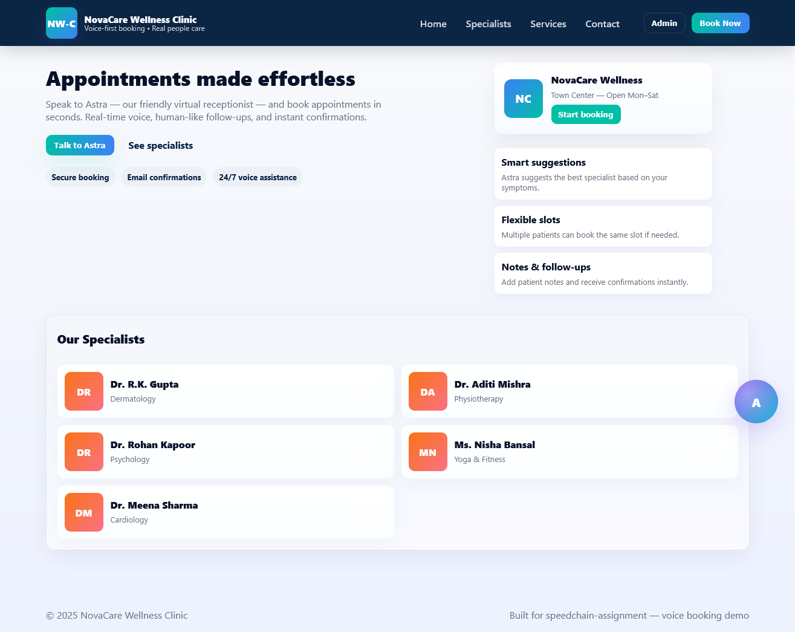
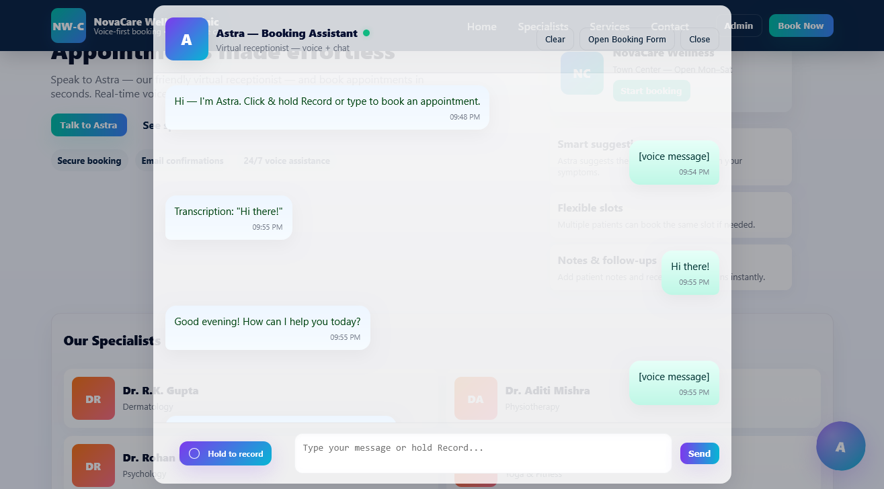

#  speedchain-assignment — AI Receptionist Assistant

**Project Title:** AI Receptionist Assistant  
**Persona:** *Astra* — Virtual Receptionist for **NovaCare Wellness Clinic**  
**Tech Stack:** FastAPI • React (Vite) • Whisper • GPT • gTTS/ElevenLabs • JSON Storage  
**Assignment:** Speedchain AI Full Stack Intern — Technical Task  

---

## 🌐 Project Overview

**Astra** is an intelligent, voice-first AI receptionist that allows patients to:

- 🎙️ Speak naturally to book appointments,
- 💬 Receive instant, human-like voice replies,
- 🧠 Maintain context throughout the conversation,
- 📅 Schedule appointments automatically, and
- 📧 Receive confirmation emails.

The assistant represents a fictional clinic, **NovaCare**, which offers dermatology, cardiology, physiotherapy, and other healthcare services.




---

## 🧩 System Architecture

```plaintext
🎤 User
   │ (voice)
   ▼
┌───────────────────────────┐
│  Frontend (React + Vite)  │
│───────────────────────────│
│ • Record user voice       │
│ • Send audio to backend   │
│ • Display Astra chat UI   │
│ • Play AI voice reply     │
└──────────────┬────────────┘
               │
               ▼
┌───────────────────────────┐
│    Backend (FastAPI)      │
│───────────────────────────│
│ 1️⃣ STT → Whisper / faster-whisper       │
│ 2️⃣ LLM → GPT-4o-mini (intent & entities) │
│ 3️⃣ TTS → ElevenLabs / gTTS              │
│ 4️⃣ Session Memory → JSON files          │
│ 5️⃣ Booking → Save + Email confirm        │
└──────────────┬────────────┘
               │
               ▼
┌───────────────────────────┐
│         Data Layer         │
│───────────────────────────│
│ • doctors.json             │
│ • bookings.json            │
│ • sessions.json            │
│ • smtp.json / openai.json  │
└───────────────────────────┘
               │
               ▼
📧 Sends confirmation email via Gmail SMTP
````

---

## 🗂️ Repository Structure

```bash
speedchain-assignment/
├─ backend/
│  ├─ main.py
│  ├─ requirements.txt
│  ├─ routes/
│  ├─ services/
│  ├─ data/
│  │   ├─ doctors.json
│  │   ├─ bookings.json
│  │   ├─ smtp.json
│  │   └─ openai.json
│  └─ ...
│
├─ frontend/
│  ├─ index.html
│  ├─ src/
│  │   ├─ components/
│  │   └─ assets/
│  ├─ package.json
│  └─ vite.config.js
│
├─ README.md
└─ demo.mp4  (or loom-link.txt)
```

---

## ⚙️ Quick Start — Backend

### 1️⃣ Create and activate virtual environment

```bash
cd backend
python -m venv .venv
# Windows
.venv\Scripts\activate
# macOS/Linux
source .venv/bin/activate
pip install -r requirements.txt
```

---

### 2️⃣ Prepare `backend/data/` files

#### `doctors.json`

Example seed data:

```json
[
  {
    "id": 1,
    "name": "Dr. R.K. Gupta",
    "specialization": "Dermatology",
    "available_slots": ["Wed 10:00", "Fri 16:00"]
  },
  {
    "id": 2,
    "name": "Dr. A. Sharma",
    "specialization": "General Medicine",
    "available_slots": ["Mon 11:00", "Thu 15:00"]
  }
]
```

#### `bookings.json`

```json
[]
```

#### `openai.json`

```json
{
  "api_key": "sk-REPLACE_WITH_YOUR_KEY"
}
```

#### `smtp.json`

```json
{
  "host": "smtp.gmail.com",
  "port": 587,
  "use_tls": true,
  "username": "your.email@gmail.com",
  "password": "APP_PASSWORD_OR_TOKEN",
  "from_email": "NovaCare Clinic <your.email@gmail.com>"
}
```

> 💡 For Gmail SMTP, use an **App Password** (not your real password).
> Enable “Less secure app access” if needed.

---

### 3️⃣ Run backend server

```bash
uvicorn main:app --reload --port 8000
```

Backend runs on **[http://localhost:8000](http://localhost:8000)**

---

## 💻 Quick Start — Frontend (React / Vite)

```bash
cd frontend
npm install
npm run dev
```

Frontend runs on **[http://localhost:3000](http://localhost:3000)**

Ensure this line in
`src/components/AssistantButton.jsx`:

```js
const API_BASE = "http://localhost:8000/api";
```

---

## 🧠 Features

| Feature                | Description                                                              |
| ---------------------- | ------------------------------------------------------------------------ |
| 🎙 Speech Input        | Users can talk naturally — Astra converts audio to text using Whisper    |
| 💬 Smart Understanding | GPT-4o-mini extracts entities like name, specialization, email, and slot |
| 🔊 Voice Reply         | Astra responds using ElevenLabs or gTTS (human-like voice)               |
| 🧠 Session Memory      | Maintains context across multi-turn conversations                        |
| 📅 Booking Flow        | Auto-fills booking form and stores data in `bookings.json`               |
| 📧 Email Notification  | Sends beautifully formatted confirmation emails via SMTP                 |
| 🩺 Doctor Panel        | Dynamic doctor data fetched from `doctors.json`                          |
| 🌙 Modern UI           | Responsive, Siri-style glassmorphic chat with real-time TTS              |

---

## 🧭 Conversation Flow

1. User greets Astra → greeting response (morning/evening aware).
2. User says “I want to book an appointment.”
3. Astra asks symptoms → user responds.
4. LLM infers correct specialization (e.g. “skin” → Dermatology).
5. Astra suggests doctor and available slots.
6. User confirms → asked for name & email.
7. Astra creates booking → saves to `bookings.json`.
8. Confirmation email sent via SMTP.
9. Chat UI shows green success toast.

---

## 🧩 Memory & Scheduling Logic

* **Session-based memory** stored per `session_id` in JSON.
* Astra keeps metadata:
  `patient_name`, `doctor_name`, `specialization`, `slot`, `note`, `email`.
* On confirmation, data is written to `bookings.json` with timestamp (IST).
* **Multiple bookings per slot** allowed (clinic policy).

---

## 🔊 Model Choices

| Component                            | Technology                      | Notes                                 |
| ------------------------------------ | ------------------------------- | ------------------------------------- |
| **STT (Speech-to-Text)**             | OpenAI Whisper / faster-whisper | Converts audio → text                 |
| **LLM (Intent & Entity Extraction)** | OpenAI GPT-4o-mini              | Detects intent, extracts patient info |
| **TTS (Text-to-Speech)**             | ElevenLabs / gTTS               | Returns base64 audio to frontend      |
| **Memory**                           | JSON file                       | Persistent across sessions            |
| **Email**                            | SMTP via Gmail                  | Sends confirmation email to patient   |

---

## 🧱 API Endpoints Summary

| Method | Endpoint                | Purpose                           |
| ------ | ----------------------- | --------------------------------- |
| `POST` | `/api/voice/transcribe` | STT — Transcribe audio to text    |
| `POST` | `/api/voice/converse`   | Core LLM flow: understand & reply |
| `GET`  | `/api/doctors`          | Fetch doctor list                 |
| `POST` | `/api/bookings/create`  | Create new appointment            |
| `POST` | `/api/session/new`      | Initialize chat session           |

---

## 🎬 Demo Video

📹 **[Loom Video Link](https://www.loom.com/share/b2e294f228f54daf84530ba4c64710e8)**

(Shows: Architecture → Voice Interaction → Appointment Booking → Email Confirmation)

---

## 🧑‍💻 Developer Notes

* You can switch models easily (OpenAI → Gemini, etc.) by editing `services/llm_service.py`.
* No database needed — all storage is JSON-based for portability.
* Booking form UI supports both manual and voice-based workflows.
* Works offline (using faster-whisper + gTTS).

---

## 🧾 Example Output (Email Confirmation)

**Subject:** ✅ Appointment Confirmed — NovaCare Wellness Clinic
**Body:**

```
Dear Uday Garg,

Your appointment with Dr. R.K. Gupta (Dermatology) has been successfully booked.

🗓 Date & Time: Wednesday, 10:00 AM  
📍 Location: NovaCare Wellness Clinic  
🧾 Notes: Skin allergy & rash

Thank you for choosing NovaCare!  
We look forward to serving you.

— Astra (Virtual Receptionist)
```

---

## 🚀 Future Enhancements

* Replace JSON with SQLite or MongoDB
* Google Calendar sync for appointments
* Multi-clinic support
* Improved multi-language voice model (Hindi + English)
* Add analytics dashboard for admins

---

## 🧑‍💼 Author

**Developer:** Uday Garg
**Assignment:** Speedchain — AI Full Stack Intern
**Project Name:** *NovaCare — AI Receptionist Assistant*


---

## 🏁 License

This project is developed for **Speedchain AI Internship Assessment** 